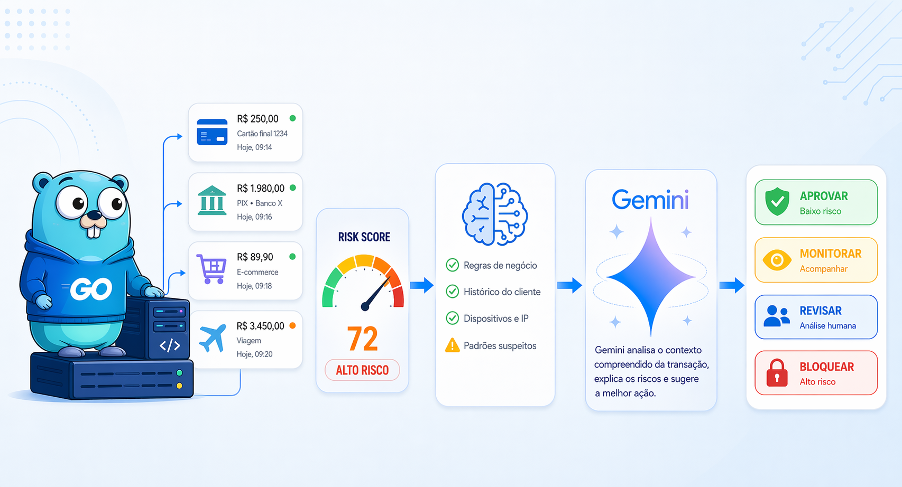

# anomaly-guard-go

Mini projeto em Go para demonstrar deteccao de anomalias com tomada de decisao orientada por IA.

O fluxo e simples:

1. A API recebe transacoes em `POST /analyze`
2. Um detector estatistico em Go calcula um `anomaly_score`
3. Se a transacao parecer suspeita, o projeto pode consultar o Gemini
4. A resposta final traz risco, acao recomendada, prioridade e motivo

## Por que esse projeto funciona bem para LinkedIn

- Mostra backend em Go
- Mostra uma abordagem de ML-like sem Python
- Usa IA generativa para decisao, nao so para texto
- Tem escopo pequeno o suficiente para explicar em um post ou demo rapida

## Estrutura

```text
cmd/api/main.go
internal/anomaly
internal/decision
internal/gemini
internal/http
internal/model
```

## Rodando localmente

```bash
go run ./cmd/api
```

Servidor padrao: `http://localhost:8080`

## Variaveis de ambiente

```bash
PORT=8080
GEMINI_API_KEY=seu_token
GEMINI_MODEL=gemini-2.5-flash
```

Se `GEMINI_API_KEY` nao estiver definida, a API usa uma heuristica local para decidir a acao.

## Endpoint

### `POST /analyze`

Payload:

```json
{
  "transactions": [
    {
      "id": "tx-001",
      "account_id": "acc-9",
      "amount": 8900,
      "hour": 3,
      "region": "unknown",
      "known_region": false,
      "failed_attempts_10m": 4,
      "minutes_since_last_tx": 1
    },
    {
      "id": "tx-002",
      "account_id": "acc-9",
      "amount": 120,
      "hour": 14,
      "region": "sao-paulo",
      "known_region": true,
      "failed_attempts_10m": 0,
      "minutes_since_last_tx": 180
    }
  ]
}
```

Exemplo com `curl`:

```bash
curl -X POST http://localhost:8080/analyze \
  -H "Content-Type: application/json" \
  -d @sample-request.json
```

Resposta esperada:

```json
{
  "summary": {
    "total": 2,
    "suspicious": 1
  },
  "results": [
    {
      "transaction": {
        "id": "tx-001",
        "account_id": "acc-9",
        "amount": 8900,
        "hour": 3,
        "region": "unknown",
        "known_region": false,
        "failed_attempts_10m": 4,
      "minutes_since_last_tx": 1
      },
      "anomaly_score": 0.99,
      "suspicious": true,
      "risk_level": "critical",
      "recommended_action": "block",
      "priority": "P1",
      "reason": "High anomaly score combined with strong fraud indicators such as repeated failed attempts or an unknown region.",
      "decision_source": "heuristic"
    }
  ]
}
```

## Rota de health check

```text
GET /health
```

## Ideia de post

> Montei um mini motor antifraude em Go que detecta anomalias sem Python e usa Gemini para apoiar a tomada de decisao. O detector gera um score de risco e a IA decide entre aprovar, monitorar, revisar manualmente ou bloquear a transacao.
